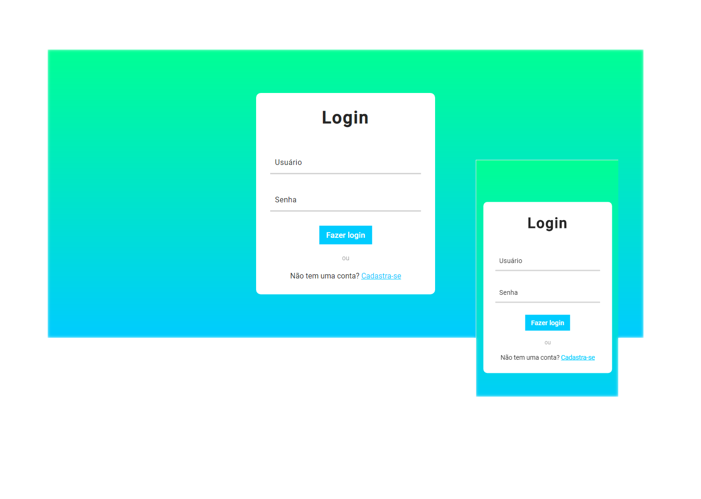

<div align="center">

<h1>Página de login</h1>
<p>Esta é uma simples página de login e cadastro de usuarios criado com ReactJS.</p>


</div>

## :rocket: Tecnologias

- ReactJS
- JavaScript
- React Router Dom

## :artificial_satellite: Instalação ou vizualização

**Você pode acessar este site clicando [aqui]()**

Para instalar clone este repositório com:
````bash
git clone https://github.com/jefferson-calmon/login-page.git
```
Acesse o repositório, radando ```cd login-page```

Execute ```yarn``` para instalar as dependências.

Execute ```yarn start``` para iniciar um servidor de desenvolvimento.

Acesse
```
http://localhost:3000/
```
em seu navegador para abrir o projeto.